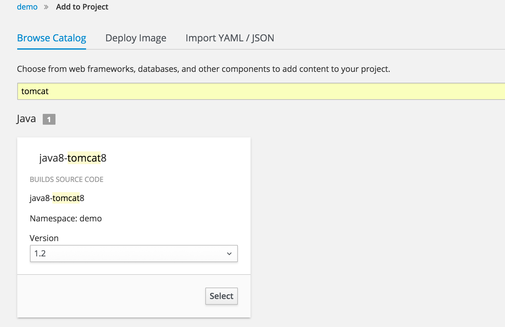

S2I 基本概念

[Source-to-Image(S2i)](https://github.com/openshift/source-to-image) 是一个从代码构架镜像的框架，工作流程是：运行一个builder 基础镜像，并将用户代码注入到容器里，经过编译，参数配置等过程，最终产生一个可以运行的镜像。使用s2i的最大优势就是对开发友好，在制作S2I 镜像前，你必须理解一下几个概念 builder 镜像 和 S2I脚本

- Builder 镜像

  Builder 镜像是一个用户构建运行时镜像的基础镜像，可以是任何一个镜像；OpenShift CICD 流程中，启动自定义的builder镜像，在容器完成中从github 或者SVN 中拉取代码，编译，环境配置等过程，将这个运行的容器commit 成一个可运行的镜像。

- S2I 脚本

  S2I 必须包含以下2个脚本

  - assemble:  的主要功能是完成代码拉去，编译等工作，用户可以自定义
  - run： 最终生成镜像的启动命令

  在制作builder 镜像时，要将这两个脚本放到builder 镜像内，那么openshift 是如何知道builder 镜像中的脚本路径的呢，每次build时，openshift 会通过以下途径检查脚本是否存在

  1. 参数 --scripts-url 
  2. 应用源代码的 .s2i/bin 下
  3. 通过builder 镜像的 **io.openshift.s2i.scripts-url** lebel

  不论是 io.openshift.s2i.scripts-url 标签，还是 --scripts-url  参数，都可以通过以下的一种方式表示：

  - **image:///path_to_scripts_dir** Builder镜像里的绝对路径
  - **file:///path_to_scripts_dir** 宿主机的相对或者绝对路径
  - **http(s)://path_to_scripts_dir** http 服务器上的地址


## S2I Builder镜像制作

为了方便Builder 基础镜像制作，Openshift 提供了[Source-to-Image(S2i)](https://github.com/openshift/source-to-image)工具；

github 项目地址： [https://github.com/openshift/source-to-image](https://github.com/openshift/source-to-image)

下载地址： [https://github.com/openshift/source-to-image/releases](https://github.com/openshift/source-to-image/releases)

下面介绍如何制作一个tomcat + maven 的builder 基础镜像，并通过这个builder 镜像完成从代码到可运行镜像的构建

**Step1 :**

下载S2I 工具，并执行一下命令：

```shell
$ s2i create registry.ocp.will.com/s2i/tomcat-maven-builder:1.0 dest
```

dest 是s2i工具自动为我们生成的一些配置文件；结构如下：

 * Dockerfile
 * Makefile
 * s2i/bin/assemble
 * s2i/bin/run
 * s2i/bin/save-artifacts
 * s2i/bin/usage

**Step2 :**

准备好基础的工具包：apache-maven-3.5.2， apache-tomcat-8.0.46， jdk1.8.0_121，当然也可以在制作镜像的过程中下载安装；

编辑Dockerfile

```dockerfile
# registry.ocp.will.com/s2i/tomcat-maven-builder:1.0
FROM openshift/base-centos7

# TODO: Put the maintainer name in the image metadata
MAINTAINER will <zhguo@dataman-inc.com>

# TODO: Rename the builder environment variable to inform users about application you provide them
# ENV BUILDER_VERSION 1.0

# TODO: Set labels used in OpenShift to describe the builder image
#LABEL io.k8s.description="Platform for building xyz" \
#      io.k8s.display-name="builder x.y.z" \
#      io.openshift.expose-services="8080:http" \
#      io.openshift.tags="builder,x.y.z,etc."

# TODO: Install required packages here:
# RUN yum install -y ... && yum clean all -y

# TODO (optional): Copy the builder files into /opt/app-root
# COPY ./<builder_folder>/ /opt/app-root/
COPY jdk1.8.0_121 /opt/app-root/jdk1.8.0_121
COPY apache-tomcat-8.0.46 /opt/app-root/apache-tomcat-8.0.46
COPY apache-maven-3.5.2 /opt/app-root/apache-maven-3.5.2


# TODO: Copy the S2I scripts to /usr/libexec/s2i, since openshift/base-centos7 image
# sets io.openshift.s2i.scripts-url label that way, or update that label
COPY ./s2i/bin/ /usr/libexec/s2i

# Set env
ENV JAVA_HOME /opt/app-root/jdk1.8.0_121
ENV TOMCAT_HOME /opt/app-root/apache-tomcat-8.0.46
ENV MAVEN_HOME /opt/app-root/apache-maven-3.5.2
ENV PATH $JAVA_HOME/bin:$MAVEN_HOME/bin:$PATH

# TODO: Drop the root user and make the content of /opt/app-root owned by user 1001
# RUN chown -R 1001:1001 /opt/app-root
# openshift 为了容器安全，使用非root 用户启动容器，默认是一个root组的随机id 用户
# openshift/base-centos7 基础镜像中有用户id为1001的root组用户，所有我们将需要操作的数据文件都赋给
# 1001:0
RUN chown -R 1001:0 /opt/app-root
RUN chown -R 1001:0 /usr/libexec/s2i

# This default user is created in the openshift/base-centos7 image
USER 1001
WORKDIR /opt/app-root/

# TODO: Set the default port for applications built using this image
EXPOSE 8080

# TODO: Set the default CMD for the image
# CMD ["/usr/libexec/s2i/usage"]

```

编辑 assemble 文件

```shell
#!/bin/bash -e
#
# S2I assemble script for the 'registry.ocp.will.com/s2i/tomcat-maven-builder:1.0' image.
# The 'assemble' script builds your application source so that it is ready to run.
#
# For more information refer to the documentation:
#       https://github.com/openshift/source-to-image/blob/master/docs/builder_image.md

# If the 'registry.ocp.will.com/s2i/tomcat-maven-builder:1.0' assemble script is executed with the '-h' flag, print the usage.
if [[ "$1" == "-h" ]]; then
        exec /usr/libexec/s2i/usage
fi

# Restore artifacts from the previous build (if they exist).
#
if [ "$(ls /tmp/artifacts/ 2>/dev/null)" ]; then
  echo "---> Restoring build artifacts..."
  mv /tmp/artifacts/. ./
fi

DEPLOY_DIR=$TOMCAT_HOME/webapps/
LOCAL_SOURCE_DIR=${HOME}
mkdir -p $LOCAL_SOURCE_DIR

echo $LOCAL_SOURCE_DIR

# builder过程默认会将源代码下载到 /tmp/src/ 目录下
echo "---> Installing application source..."
ls /tmp/src/
cp -Rf /tmp/src/. $LOCAL_SOURCE_DIR

echo "---> Building application from source with maven..."
# TODO: Add build steps for your application, eg npm install, bundle install, pip install, etc.
# If a pom.xml is present, this is a normal build scenario
# so run maven.
if [ -f "$LOCAL_SOURCE_DIR/pom.xml" ]; then
  if [ -z "$MAVEN_ARGS" ]; then
    export MAVEN_ARGS="package -Popenshift -DskipTests -B"
  fi

  echo "Found pom.xml... attempting to build with 'mvn ${MAVEN_ARGS}'"
    cd $LOCAL_SOURCE_DIR
  mvn --version
  mvn $MAVEN_ARGS

  ERR=$?
  if [ $ERR -ne 0 ]; then
    echo "Aborting due to error code $ERR from mvn package"
    exit $ERR
  fi

# 将编译后的war 包移动到tomcat 部署目录下
TARGET_DIR=${LOCAL_SOURCE_DIR}/target
  echo "Moving built war files into $DEPLOY_DIR for later deployment..."
  mv ${TARGET_DIR}/*.war $DEPLOY_DIR
fi

echo "...done"
```

编辑run 文件

```shell
#!/bin/bash -e
#
# S2I run script for the 'registry.ocp.will.com/s2i/go-builder:1.0' image.
# The run script executes the server that runs your application.
#
# For more information see the documentation:
#       https://github.com/openshift/source-to-image/blob/master/docs/builder_image.md
# 

# 这个命令作为可运行镜像的启动命令
exec $TOMCAT_HOME/bin/catalina.sh run
```

在builder 镜像中执行完assemble 脚本后，openshift 会将这个运行态的容器commit 成一个镜像，并推送到内容镜像仓库，至此，s2i(从源码构建镜像)的过程就完成了。

**Step 3**: 

更了更方便的使用builder 镜像实现s2i 流程，我们制作一个ImageStraem, 脚本如下：

执行oc create -f tomcat-maven.json

```json
{
    "kind": "ImageStream",
    "apiVersion": "v1",
    "metadata": {
        "name": "java8-tomcat8",
                "annotations":{"openshift.io/image.insecureRepository": "true"}
    },
    "spec": {
        "dockerImageRepository": "registry.ocp.will.com:5000/s2i/tomcat-maven-builder",
        "tags": [
            {
                "name": "1.0",
                "annotations": {
                    "description": "java8-tomcat8",
                    "iconClass": "tomcat8",
                    "tags": "builder,java,tomcat",
                    "supports":"java:8,tomcat8",
                    "sampleRepo": "https://github.com/Willbern/openshift-jee-sample.git",
                    "version": "1.0"
                }
            }
        ]
    }
}

```

从UI 发布应用，选择Browse Catalog， 搜索tomcat，就会发现我们制作的ImageStream, 如下：



s2i 还是有更高级的用法，比如增量编译等，这里就不详细介绍了，感兴趣的请[点击这里](https://github.com/openshift-s2i/s2i-wildfly/tree/master/11.0 )参考：

​    
